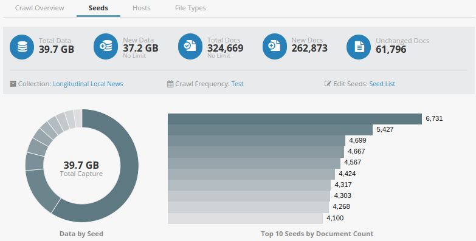
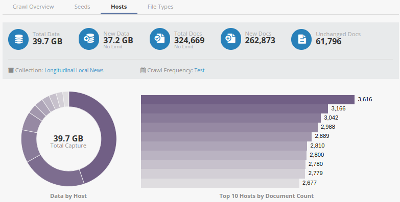
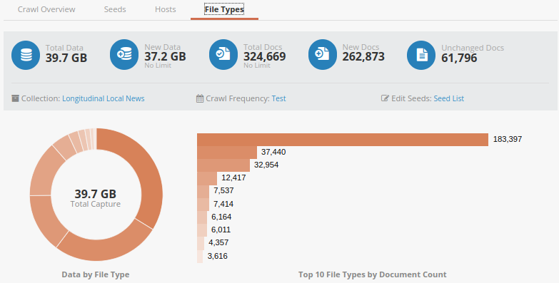
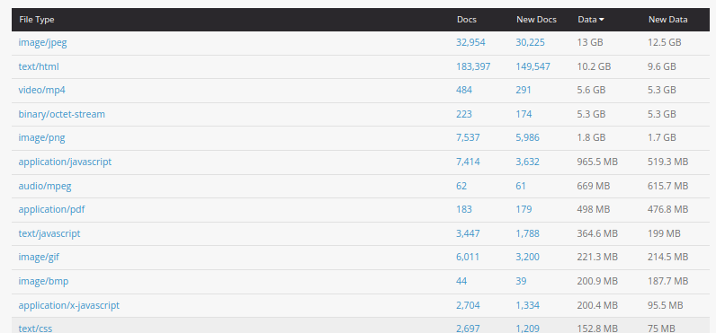

# Building Longitudinal Local News Repository

---

## Table of Contents
1. [Introduction](#1-introduction)
2. [Dataset](#2-dataset)
   - [2.1 Data](#21-data)
   - [2.2 Data Preprocessing](#22-data-preprocessing)
     - [2.2.1 Verifying the Status of News Website URLs](#221-verifying-the-status-of-news-website-urls)
     - [2.2.2 Identifying RSS Feeds for Websites](#222-identifying-rss-feeds-for-websites)
       - [2.2.2.1 Extracting RSS Feeds from HTML Metadata](#2221-extracting-rss-feeds-from-html-metadata)
       - [2.2.2.2 Discovering RSS Feeds via Sitemaps](#2222-discovering-rss-feeds-via-sitemaps)
3. [News Article Filtering Process](#3-news-article-filtering-process)
4. [Building a Longitudinal News Repository](#4-building-a-longitudinal-news-repository)
   - [4.1 Storing News Articles Locally](#41-storing-news-articles-locally)
     - [4.1.1 Process Overview](#411-process-overview)
     - [4.1.2 Implementation](#412-implementation)
     - [4.1.3 File Storage Structure](#413-file-storage-structure)
     - [4.1.4 Limitations](#414-limitations)
   - [4.2 Utilizing Internet Archive](#42-utilizing-internet-archive)
     - [4.2.1 Archiving Workflow](#421-archiving-workflow)
       - [4.2.1.1 Tool Setup and Verification](#4211-tool-setup-and-verification)
       - [4.2.1.2 Archiving URLs](#4212-archiving-urls)
     - [4.2.2 File Structure for Archived Metadata](#422-file-structure-for-archived-metadata)
     - [4.2.3 Challenges Encountered](#423-challenges-encountered)
     - [4.2.4 Limitations](#424-limitations)
   - [4.3 Using Archive-It](#43-using-archive-it)
     - [4.3.1 Key Terminology](#431-key-terminology)
     - [4.3.2 Scoping](#432-scoping)
       - [4.3.2.1 General Scoping Rules](#4321-general-scoping-rules)
       - [4.3.2.2 Additional Scoping Rules](#4322-additional-scoping-rules)
       - [4.3.2.2 Seed Types](#4322-seed-types)
     - [4.3.3 Crawling](#433-crawling)
       - [4.3.3.1 Types of Crawls](#4331-types-of-crawls)
     - [4.3.4 Building longitudinal local news repository](#434-building-longitudinal-local-news-repository)
       - [4.3.4.1 Creating Collection](#4341-creating-collection)
       - [4.3.4.2 Start Crawling](#4342-start-crawling)
       - [4.3.4.3 Results](#4342-results)
     - [4.3.5 Limitations](#435-limitations)
5. [Discussion & Conclusion](#5-discussion-&-conclusion)


## 1. Introduction

News plays a crucial role in shaping public opinion, informing citizens, and influencing societal trends. To analyze these dynamics effectively, comprehensive and accessible news datasets are essential. Local news, in particular, serves as the backbone of community engagement and regional storytelling, yet it faces significant challenges such as shrinking revenues, newsroom closures, and insufficient digital preservation efforts. 

This project addresses the research question: **How can a longitudinal local news repository be constructed to capture news coverage across diverse U.S. communities, and what challenges are inherent in maintaining such a repository over time?** By leveraging web science technologies such as web scraping and web archiving, the repository ensures that local news remains accessible and usable for analysis over time. This report details the repository’s development process, the methodologies employed, the challenges encountered, and the outcomes of the project. 

## 2. Dataset

### 2.1. Data
The foundation for constructing the longitudinal local news repository is based on the local news website dataset from the 3DLNews repository. The dataset consists of 14,086 local media outlets, serving as the seed URLs for the repository. The dataset can be found here: [usa_2016_2024_pu5e.json](data/usa_2016_2024_pu5e.json). Below is a breakdown of the dataset composition:

| Media Type | Number of websites |
|-------------|--------------------|
| Newspapers  | 9,441              |
| Radio       | 2,449              |
| Broadcast   | 1,310              |
| TV          | 886                |
| **Total**   | **14,086**         |

### 2.2. Data preprocessing

To prepare the base dataset for building the longitudinal news repository, several preprocessing steps were undertaken. Below, I describe the key tasks performed during this phase.

#### 2.2.2. Verifying the Status of News Website URLs

Before constructing the repository, it was important to identify which websites from the dataset were actively functioning. This was accomplished by determining the HTTP response status code for each website URL. The steps taken were as follows:

1. Read the JSON data containing the website URLs.
2. Loop through each record to extract the URL from the website property.
3. Send an HTTP GET request to the extracted URL.
4. Record the HTTP status code returned by the server.
5. Append the status code to the corresponding dataset entry and save the updated data.

The Python function used to retrieve the status codes is provided below. The full implementation can be found in [process-website-status-code.py](src/process-website-status-code.py)

```python3
# Function to get the status code of a URL
def get_status_code(url):
    try:
        response = requests.get(url)
        return response.status_code
    except requests.exceptions.RequestException as e:
        print(f"Error fetching {url}: {e}")
        return None  # Return None in case of an error

# Update the dataset with website status codes
for state, media_types in data.items():
    for media_type, media_list in media_types.items():
        for media in media_list:
            website_url = media.get('website')
            if website_url:
                media['website_status'] = get_status_code(website_url)
```

#### 2.2.2. Identifying RSS Feeds for Websites

Although some RSS feed URLs were present in the existing dataset, updates were needed to ensure completeness and accuracy. To find RSS feeds for the websites, the following approaches were utilized:

**2.2.2.1. Extracting RSS Feeds from HTML Metadata**

This method involved analyzing the website’s HTML structure to locate <link> tags specifying RSS or Atom feed URLs. The complete code is added here: [update-rss-with-types.py](src/update-rss-with-types.py) The key implementation is as follows:

```python3
def find_feed_url(url):
    try:
        response = requests.get(url, timeout=5)
        response.raise_for_status()  # Check for successful response
        soup = BeautifulSoup(response.content, "html.parser")
        
        # Search for link tags with relevant MIME types
        feed_types = ["application/rss+xml", "application/atom+xml", "text/xml", "application/xml"]
        for feed_type in feed_types:
            link = soup.find("link", type=feed_type)
            if link and link.get("href"):
                return link["href"]
    except requests.exceptions.RequestException as e:
        print(f"Error processing {url}: {e}")
    return None  # Return None if no feed URL is found
```

##### 2.2.2.2. Discovering RSS Feeds via Sitemaps

This section explains how to discover RSS feed URLs by analyzing a website's sitemap. A sitemap is a file (usually in XML format) that websites provide to help search engines and crawlers discover and index their pages. RSS feeds, which provide machine-readable updates about site content, can sometimes be included in these sitemaps.

The provided Python code: [update-rss-with-sitemap.py](src/update-rss-with-sitemap.py) demonstrates how to systematically retrieve and parse a website's sitemap(s) to identify potential RSS feed links. Here's a step-by-step explanation of the process and the corresponding key functions:

**Step 1: Construct the robots.txt URL**
The robots.txt file often contains links to sitemaps. Constructs the robots.txt URL by appending robots.txt to the base URL.

**Step 2: Retrieve Sitemap URLs from robots.txt**
The function checks for sitemap links in the robots.txt file. 
- Retrieve the content of robots.txt.
- Search for lines beginning with "Sitemap:".
- Extract and return the URLs after the "Sitemap:" keyword.

**Step 3: Identify Common Sitemap Locations** 
If robots.txt doesn’t specify a sitemap, the function tries common locations such as sitemap.xml or sitemap_index.xml.

**Step 4: Extract RSS Links from the Sitemap**
Once a sitemap is identified, parses it for RSS-related links.
- Fetch and parse the sitemap content using BeautifulSoup with XML parsing.
- Extract all <loc> tags, which typically contain URLs for pages or feeds.
- Filter and return URLs that suggest they are RSS feeds (contain "rss" or "feed").

```python3
def get_robots_txt_url(url):
    """Construct the robots.txt URL."""
    return urljoin(url, "robots.txt")

def get_sitemap_from_robots(url):
    """Retrieve sitemap URLs from robots.txt."""
    robots_url = get_robots_txt_url(url)
    try:
        response = requests.get(robots_url, timeout=5)
        response.raise_for_status()
        sitemap_urls = [
            line.split(":", 1)[1].strip()
            for line in response.text.splitlines()
            if line.lower().startswith("sitemap:")
        ]
        return sitemap_urls
    except requests.RequestException:
        return None

def get_sitemap_url(url):
    """Find common sitemap URLs."""
    common_sitemaps = [urljoin(url, "sitemap.xml"), urljoin(url, "sitemap_index.xml")]
    for sitemap in common_sitemaps:
        try:
            response = requests.get(sitemap, timeout=5)
            if response.status_code == 200:
                return sitemap
        except requests.RequestException:
            continue
    return None

def get_rss_from_sitemap(sitemap_url):
    """Extract RSS links from the sitemap."""
    try:
        response = requests.get(sitemap_url, timeout=5)
        response.raise_for_status()
        soup = BeautifulSoup(response.content, "xml")
        return [loc.text for loc in soup.find_all("loc") if "rss" in loc.text or "feed" in loc.text]
    except requests.RequestException:
        return None
```
So the final data with RSS feeds and status codes are attached here: [news-websites_with_status_code_and_rss.json][data/website_with_status_code_and_rss.json. The website JSON object in the dataset will look as follows.
```
{
    "video": "http://www.youtube.com/user/fairbanksnewsminer",
    "twitter": "http://www.twitter.com/newsminer",
    "media-class": "newspaper",
    "extracted-from": "usnpl.com, thepaperboy.com",
    "city-county-long": -147.72045,
    "media-subclass": "city-county",
    "website": "http://www.newsminer.com/",
    "facebook": "https://www.facebook.com/fairbanksDNM",
    "city-county-lat": 64.83507,
    "name": "Fairbanks Daily News-Miner",
    "open-search": [],
    "city-county-name": "Fairbanks",
    "rss": [
        "http://www.newsminer.com/search/?f=rss&t=article&l=50&s=start_time&sd=desc&k[]=%23topstory"
    ],
    "us-state": "Alaska",
    "wikipedia": "https://en.wikipedia.org/wiki/Fairbanks_Daily_News-Miner",
    "instagram": "https://www.instagram.com/fairbanksdnm/",
    "youtube": "http://www.youtube.com/user/fairbanksnewsminer",
    "website_status": 200
}
```
These preprocessing steps ensured that only active and relevant websites were included in the repository while also providing accurate and updated RSS feed URLs for further analysis.


## 3. News Article Filtering Process

When building a longitudinal news repository, it is required to have a filtering mechanism for News articles. Given the absence of a universal standard for news article URL formats, the implemented filtering process primarily relied on three key properties: **path depth**, **word boundary**, and **word count per article**.

- **Path Depth**: This refers to the number of hierarchical levels in a URL’s path. For example:  
  - [https://example.com/](https://example.com/) has a path depth of 0.  
  - [https://example.com/foo](https://example.com/foo) has a path depth of 1.  
  - [https://example.com/foo/bar](https://example.com/foo/bar) has a path depth of 2.
- **Word Boundary**: Symbols that separate words in a URL. For example, in the URL [https://example.com/this-is-a-page](https://example.com/this-is-a-page), the word boundary is `-`.
- **Word Count**: The number of words in the textual content retrieved from a URL.

The filtering process involved the following steps:

1. **Dereferencing URLs**: All URLs were dereferenced to resolve redirects and obtain their final forms.  
2. **Domain Matching**: URLs with domains not included in the local news media dataset were discarded.  
3. **Normalization**: URLs were standardized by converting them to lowercase, removing trailing slashes, and eliminating duplicates.  
4. **Path Depth Filtering**:  
   - URLs with a path depth of 0 (e.g., homepages) were excluded.  
   - URLs with a path depth of 3 or greater were retained, as these typically point to articles or specific content pages.  
5. **Word Boundary Filtering**: URLs with a path depth of less than 3 were included if they contained common word-boundary separators such as `-`, `_`, or `.` (e.g., [http://kwgs.org/post/funeral-set-ou-quarterback-killed-crash](http://kwgs.org/post/funeral-set-ou-quarterback-killed-crash)).  
6. **Word Count Validation**: Content retrieved from URLs was assessed for word count. URLs pointing to pages with fewer than 20 words were excluded.

The following Python code illustrates the URL filtering logic:

```python3
def is_news_article(link):
    # Expand and validate the URL
    link = get_expanded_url(link)
    if not is_valid_url(link):
        print(f"Invalid URL: {link}")
        return False

    # Parse the URL and extract path segments
    parsed_url = urlparse(link)
    path_segments = [segment for segment in parsed_url.path.split('/') if segment]

    # Check path depth and special character conditions
    depth = len(path_segments)
    if depth >= 3 or (depth <= 2 and any(has_special_characters(segment) for segment in path_segments[:2])):
        is_news_article = True
    else:
        return False

    # Validate content on the page
    try:
        html = derefURI(link)
        plaintext = cleanHtml(html)
        word_count = len(plaintext)

        if word_count > 20:
            return True
        else:
            print(f"Word count too low for {link}\n{plaintext}\n")
            return False
    except Exception as e:
        print(f"Error processing link: {link} due to {e}\n")
        return False
```

## 4. Building a Longitudinal News Repository

To build the longitudinal local news repository I have followed three separate approaches as outlined in this section.

### 4.1 Storing News Articles Locally

Initially, I tried to build a longitudinal news repository by storing news articles locally. Below is the key implementation, with the complete code available here: [html-news-collector.py](src/html-news-collector.py).

#### 4.1.1 Process Overview

- **For Links with RSS Feeds**:  
  1. Extracted article links from the RSS XML.  
  2. Extracted publication dates.  
  3. Archived each article and retrieved the archived URL.  
  4. Stored the archive timestamp.

- **For Links without RSS Feeds**:  
  1. Retrieved the homepage and extracted article links.  
  2. Filtered the extracted article links.  
  3. Extracted publication dates.  
  4. Archived each article and retrieved the archived URL.  
  5. Stored the archive timestamp.

#### 4.1.2 Implementation 

The following Python code snippet illustrates the process of saving article HTML content and organizing it by state, date, and website:

```python
def save_article_html(directory, article_url, html_content):
    """
    Save the HTML content of an article to a file.
    """
    try:
        article_hash = hashlib.md5(article_url.encode()).hexdigest()
        filepath = os.path.join(directory, f"{article_hash}.html.gz")
        os.makedirs(os.path.dirname(filepath), exist_ok=True)
        with gzip.open(filepath, 'wt', encoding='utf-8') as html_file:
            html_file.write(html_content)
        logging.info(f"Article HTML saved to {filepath}")
        return filepath
    except Exception as e:
        logging.error(f"Error saving article HTML for {article_url}: {e}")
        return None
```
Additional logic for processing publications, fetching content, and scraping websites was implemented to ensure completeness. The full implementation dynamically handles RSS feeds and direct website scraping.

#### 4.1.3 File Storage Structure
The locally stored files followed the structure below:
```
├── news
│   ├── <US-state>
│   │   └── <year>
│   │       └── <month>
│   │           └── <day>
│   │               ├── <hashed-webpage-url>
│   │               │   ├── <hashed-webpage-url>-<timestamp>
│   │               │   │   ├── <hashed-article-url-1>.html.gz
│   │               │   │   ├── <hashed-article-url-2>.html.gz
│   │               │   │   ├── <hashed-article-url-3>.html.gz
│   │               │   └── <hashed-webpage-url>-cache.txt.gz
│   │               │   ├── <hashed-webpage-url>.jsonl.gz

```
Purpose of Key Files:
- `<hashed-webpage-url>-cache.txt.gz`: Tracks article URLs processed in the current iteration to avoid duplication.
- `<hashed-webpage-url>.html.gz`: Contains the homepage HTML content.
- `<hashed-webpage-url>.jsonl.gz`: Stores metadata about the website and the path to the archived HTML homepage.
- `<hashed-webpage-url>-<timestamp>`: Stores the article HTML files for the current iteration, identified by the timestamp.

#### 4.1.4 Limitations
- **Storage and Scalability:** Storing large amounts of data locally can quickly consume storage space, becoming difficult to manage.
- **Data Redundancy:** There’s a risk of duplicate content being stored due to errors or repeated scraping.

### 4.2 Utilizing Internet Archive

Given the significant storage requirements of the local approach, an alternative method was developed using the Internet Archive to store articles. The archivenow tool (GitHub link) was used to automate the preservation process.

#### 4.2.1 Archiving Workflow
##### 4.2.1.1 Tool Setup and Verification
The tool was configured and tested using the following command:

```
archivenow --ia <article-url>
```
After successful verification, it was integrated into the process for archiving URLs.

##### 4.2.1.2 Archiving URLs
Articles were archived using the archivenow tool with the following key function:

```python3
def get_archived_url(link):
    """Archive a URL using Internet Archive and return the archived URL."""
    try:
        result = subprocess.run(['archivenow', '--ia', link], capture_output=True, text=True, check=True)
        output = result.stdout.strip()
        if "Error" in output:
            logging.error(f"Archive error for {link}: {output}")
            if "Server Error" in output:
                logging.warning(f"Sleeping for 2 second due to server error")
                time.sleep(2)
            return None
        return output
    except subprocess.CalledProcessError as e:
        logging.error(f"Exception during archiving {link}: {e}")
        return None
```

The complete code is attached in here: [ia-news-collector.py](src/ia-news-collector.py)

#### 4.2.2 File Structure for Archived Metadata
The metadata of archived URLs was stored in the following structure:
```
├── news
│   ├── <US-state>
│   │   └── <year>
│   │       └── <month>
│   │           └── <day>
│   │           |   ├── <hashed-webpage-url-1>
│               │   │   ├── <hashed-webpage-url-1>-cache.txt.gz
│               │   │   └── <hashed-webpage-url-1>.jsonl.gz
│               │   │   └── 2024-12-19 01:28:57.223542.jsonl.gz
│               │   ├── <hashed-webpage-url-2>
│               │   │   ├── <hashed-webpage-url-2>-cache.txt.gz
│               │   │   └── <hashed-webpage-url-2>.jsonl.gz
│               │   │   └── 2024-12-19 01:30:13.949575.jsonl.gz
```

**Purpose of Key Files:**
- `<hashed-webpage-url>-cache.txt.gz`: Tracks processed article URLs to prevent duplication.
- `<hashed-webpage-url>.jsonl.gz`: Stores website metadata, including archived homepage details.
- `<timestamp>.jsonl.gz`: Contains metadata for article URLs archived during the specified timestamp. For example:
```
{
    "link": "https://thecordovatimes.com/2024/12/06/cordova-chamber-november-gala-fundraiser/",
    "publication_date": "2024-12-06T21:00:00",
    "archived_time": "2024-12-15T00:00:59.955894",
    "archived_link": "test"
}
```
#### 4.2.3 Challenges Encountered

While automating the archiving process, the following error was encountered:

```
Failed to archive http://www.airforcetimes.com/: Error (The Internet Archive): 520 Server Error: UNKNOWN for url: https://web.archive.org/save/http://www.airforcetimes.com/news/your-navy/2024/12/10/navy-locks-in-bowl-berth-vs-oklahoma-but-rival-army-looms/
```
Upon investigation, it was discovered that the Internet Archive limits the number of archiving requests to 200 per day. Attempts to exceed this quota resulted in a server error message, as shown below:


#### 4.2.4 Limitations
- **Archiving Quotas:** The daily limit of 200 URLs can create bottlenecks and prevent timely archiving.
- **Error Handling:** Server issues or failures may disrupt the archiving process.

### 4.3 Using Archive-It

To address the limitations mentioned earlier, I explored the use of **Archive-It** to build a robust longitudinal news repository.

#### 4.3.1 Key Terminology

Before diving into the details, it’s essential to understand the primary terms used in Archive-It:

- **Collection**: A group of archived web documents curated around a common theme, topic, or domain.  
- **Seed**: An item in Archive-It with a unique ID. The seed URL serves as the starting point for crawlers and as an access point for archived content.  
- **Document**: Any file with a unique URL, such as HTML, images, PDFs, or videos. Documents are distinct from seeds, although seeds can also be documents.

#### 4.3.2 Scoping

"Scope" defines the extent to which the crawler travels to discover and archive new materials. To avoid crawling the entire web, Archive-It applies a default scope.

##### 4.3.2.1 General Scoping Rules

Archive-It’s default scope is designed to ensure efficient and relevant archiving by focusing on content directly associated with the seed URL. Here are the key details about its behavior:

- The crawler collects all embedded elements (e.g., images, stylesheets, JavaScript) on pages within the seed's site.
- Links to external sites are not followed unless explicitly specified.
- Both HTTP and HTTPS versions of URLs are automatically included.

The scope is determined using the structure of the seed URL, specifically the final forward slash (/). This determines the depth and extent of the crawl within the website structure. Examples below illustrate this behavior:

1. **Example 1: Scoped Seed URL**  
   Seed: `https://news-example.org/local/`  
   - `https://news-example.org/news-report.html` → **Not in scope** (outside `/local/` directory)  
   - `https://news-example.org/local/local-news-report.html` → **In scope**

2. **Example 2: Unscoped Seed URL**  
   Seed: `https://news-example.org/local`  
   - `https://news-example.org/news-report.html` → **In scope**  
   - `https://news-example.org/local/local-news-report.html` → **In scope**

By default, Archive-It also captures content such as images, stylesheets, and scripts that are embedded within pages, ensuring that archived materials closely resemble their live web versions. This includes any resources hosted on the same domain as the seed. However, elements hosted on third-party domains, such as analytics scripts or externally embedded videos, are not archived unless the scope is expanded to include them explicitly.

For this project, I relied on the default scope settings, ensuring that all website URLs were added with a trailing slash to precisely control the crawl boundaries.

##### 4.3.2.2 Additional Scoping Rules

By modifying the collection's scope, we can either limit (archive fewer URLs) or expand (archive more URLs) what would be captured by default, for all crawls on all seeds, in that specific collection. We can make changes by navigating to the collection, and selecting “Collection Scope” where we can: block content, add limits, ignore robots, or include content:


But for this project, I have not specified any rules, as the default standard scope captures what I require.

##### 4.3.2.3 Seed Types

A seed's type determines its crawling scope. Archive-It offers the following seed configurations:

- **Standard**: The seed is crawled within the default scope which includes any resources hosted on the same domain as the seed.  
- **Standard Plus Links (Standard+)**: Crawls the seed's default scope and the first page of URLs directly linked off the seed.  
- **One Page**: Only the seed’s first page is archived; links to other pages are ignored.  
  - Recommended for individual pages like newspaper articles or blog posts.  
- **One Page Plus Links (One Page +)**: Captures the seed's first page and the first page of any directly linked URLs.  
  - Suitable for feeds with links to external domains, such as social media, YouTube channels, or aggregated news articles.

For this project, I needed to capture news articles from news feeds. Therefore, I selected the **Standard** seed type to focus on URLs within the news website domain.

#### 4.3.3 Crawling

##### 4.3.3.1 Types of Crawls
Following are the types of crawls that Archive-it has.

1. **Test Crawls**:  
   - Data is held temporarily for 60 days to review before saving or deleting.  
   - Once saved, the crawl becomes permanent and counts toward the data budget.  
   - Archived pages from a test crawl can only be accessed through the seed report.  

2. **One-Time Production Crawls**:  
   - These are permanent crawls that directly add data to the data budget.  
   - They cannot be deleted.  

3. **Scheduled Crawls**:  
   - After running and reviewing a test crawl, scheduled crawls can be set up to occur regularly.  
   - Scheduled crawls also permanently add data to the budget and cannot be deleted.

For this project, I am currently using **test crawls** to ensure proper review and validation before committing data to the repository.

##### 4.3.3.2 Crawling Technologies
Archive-It's crawlers identify and capture live web content for archival purposes based on user-defined seeds and scope. Two crawling technologies are available: Standard and Brozzler.

- **Standard Crawler (Heritrix + Umbra)**: Best for typical web content and dynamic elements with client-side scripts.
- **Brozzler**: More advanced, browser-based capture for highly dynamic or multimedia-rich sites.

For this project, I used Standard crawling technology.

#### 4.3.4 Building Longitudinal Local News Repository

##### 4.3.4.1 Creating Collection

To create this longitudinal local news repository, I began by copying the news website URLs to use as seeds. Next, I set the access level to `public` (although "private" can also be selected if desired). Since the repository required continuous updates, I configured the crawl frequency to `Daily`. As previously explained, I selected the `Standard` Seed Type to ensure the crawler captured all URLs within the default scope.

Using these settings, I successfully created the collection with the designated seeds as shown below.


##### 4.3.4.2 Start Crawling

Once the collection was created, I initiated the crawl for all the seed URLs. I chose the Test Crawl option, as described earlier. I did not set a Document Limit or Data Limit for this test crawl, as they are not necessary for this phase. However, for the production crawl, specifying these limits will be important due to data budget constraints. I set the Time Limit to 1 Day, but the crawl would stop earlier if it completes before the specified time limit.

I tested both available crawling technologies. Each has its advantages, but I selected the Standard crawling technology, which is best suited for typical web content and dynamic elements with client-side scripts.

##### 4.3.4.3 Results
For the initial test, I used news website URLs from Virginia as seed URLs and ran the crawl with the above configurations for one day. After the crawl, the following checks were performed:

1. Crawl Overview: Verified the crawl status to ensure completion.
   
   Following image shows the crawling progression while crawling.
   
   
3. Seeds Tab: Reviewed seed statuses, checking for robots.txt blocks or issues preventing successful crawls.
   
   
4. Reports: Examined the Seeds, and File Type reports to assess crawl performance.

   3.1. Seed Report: According to this, `https://wcyb.com/` has collected maximum document count
   
   

   3.2. Hosts File Type Report:
   

   3.3. File Type Report: According to this, it has maximum document count with `text/html` type.
   
   
   
   
6. Seed Metrics: Checked the number of documents collected, data consumed, and the status of each seed.
    
   
7. Wayback Links: Browsed archived content for each seed using the Wayback Machine to validate the results.
   

Folllowing are the final results I obtained by crawling Virginia State news websites for seven days. On average per day, it has utilized 30 GB.


#### 4.3.6 Limitations
- **Data Budget Constraints**: Crawls utilize a limited storage budget, making it expensive to scale the repository for long-term use. According to the results for 7 day 
- **Test Crawl Limitation**: Daily crawls, even when configured as Test Crawls, consume the data budget starting from the second crawl onward. To collect data over a week without impacting the production budget, crawls must be manually triggered daily to avoid transitioning into production crawls.

## 5. Discussion & Conclusion

In this project, I have explored various approaches to build a longitudinal news repository, focusing on the challenges and trade-offs associated with each method. While I have successfully implemented solutions for filtering, storing, and archiving news articles, I am still in the process of experimenting with the optimal approach. Each method has its own strengths and limitations, and the goal is to identify the best strategy that balances efficiency, scalability, and reliability.

The **local storage approach**, which involves scraping news articles directly and saving them locally, offers the advantage of full control over the data and its structure. However, this method faces significant challenges in terms of storage requirements, maintenance, and handling large volumes of content over time. The complexity of managing a growing dataset, ensuring that articles are archived correctly, and dealing with potential data redundancy or corruption makes it less sustainable for long-term use without careful optimization.

On the other hand, the **Internet Archive** method provides an external solution that alleviates local storage concerns. By leveraging the archivenow tool, I can automate the preservation of articles in a cloud-based environment. While this approach is effective in terms of reducing local storage load, it faces limitations such as the Internet Archive's daily request quotas and server errors, which can disrupt the archiving process. Furthermore, the archiving delay between content creation and availability on the Internet Archive is a significant drawback when building a real-time or near-real-time repository.

Lastly, the **Archive-It** service presents a robust solution designed specifically for web archiving. It offers tools to control the scope and crawling behavior, ensuring that only relevant content is captured. However, Archive-It also comes with its own challenges, including data budget constraints and the need for careful scoping to avoid capturing irrelevant content. The potential cost associated with larger-scale crawls is another consideration when choosing this approach.

In conclusion, while each method shows promise, the choice of the best approach depends on the requirements of the project. At this stage, I am still experimenting with the right combination of local storage, Internet Archive, and Archive-It to overcome the limitations encountered with each approach. Future work will focus on refining these methods, exploring ways to automate error handling, and optimizing resource usage to ensure the creation of a comprehensive and scalable longitudinal news repository.

## References

- [1] https://github.com/wm-newslab/3DLNews
- [2] https://web.archive.org/
- [3] https://partner.archive-it.org/
- [4] https://support.archive-it.org/hc/en-us/articles/360041250172-Guide-for-new-Archive-It-users
